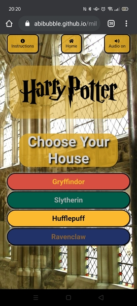
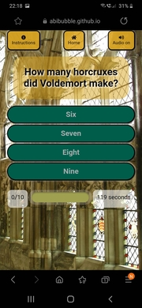
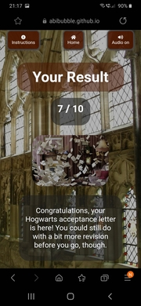

# Testing Steps

## Contents

* [Navigation Bar](#navigation-bar)
* [Styling and Layout](#styling-and-layout)
* [Pages](#pages)
* [Functions](#functions)
    * [Choose House](#choose-house)
    * [Questions](#questions)
    * [Quiz](#quiz)
    * [Score](#score)
    * [Timer](#timer)
    * [Audio](#audio)
* [Responsive Design](#responsive-design)
    * [Mobile](#mobile)
    * [Tablet](#tablet)
    * [Computer](#computer)
* [Images](#images)
    * [Desktop and Laptop](#desktop-and-laptop)
    * [Tablet](#tablet)
    * [Mobile](#mobile)

On every device and browser listed in the README.md file, I tested the following:

## Navigation Bar
* Click the Home button to take us to Home page from the Home page.
* Click the Home button to take us to Home page from the quiz page.
* Click the Home button to take us to Home page from the Instructions page.
* Click the Home button to take us to Home page from the Results page.

* Click the Instructions button to take us to Instructions from Home page.
* Click the Instructions button to take us to Instructions from the quiz page.
* Click the Instructions button to take us to Instructions from the Instructions page.
* Click the Instructions button to take us to Instructions from the Results page.

---

## Styling and Layout
* Ensure all images load correctly.
* Ensure the background image loads correctly.
* Ensure the logo loads correctly.

---

## Pages
* Ensure that the Solemnly quote page is visible when the user first loads the page.
* Ensure that the Home page is hidden when the user first loads the page.
* Ensure that the quiz page is hidden when the user first loads the page.
* Ensure that the results page is hidden when the user first loads the page.
* Ensure that the Instructions page is hidden when the user first loads the page.
* Ensure that the audio is switched off as standard when the user first loads the page.

* Ensure that the Solemnly quote page is hidden when the user clicks off the Solemnly quote page.
* Ensure that the Home page is visible when the user clicks off the Solemnly quote page.
* Ensure that the quiz page is hidden when the user clicks off the Solemnly quote page.
* Ensure that the results page is hidden when the user clicks off the Solemnly quote page.
* Ensure that the Instructions page is hidden when the user clicks off the Solemnly quote page.
* Ensure that the audio is switched off as standard when the user clicks off the Solemnly quote page.

* Ensure that the Solemnly quote page is hidden once the user chooses a house.
* Ensure that the Home page is hidden once the user chooses a house.
* Ensure that the quiz page is visible once the user chooses a house.
* Ensure that the results page is hidden once the user chooses a house.
* Ensure that the Instructions page is hidden once the user chooses a house.
* Ensure that the audio is switched off as standard once the user chooses a house.

* Ensure that the Solemnly quote page is hidden once the user completes the quiz, or runs out of time.
* Ensure that the Home page is hidden once the user completes the quiz, or runs out of time.
* Ensure that the quiz page is hidden once the user completes the quiz, or runs out of time.
* Ensure that the results page is visible once the user completes the quiz, or runs out of time.
* Ensure that the Instructions page is hidden once the user completes the quiz, or runs out of time.
* Ensure that the audio is switched off as standard once the user completes the quiz, or runs out of time.

* Ensure that the Solemnly quote page is hidden once the user clicks on the Instructions button.
* Ensure that the Home page is hidden once the user clicks on the Instructions button.
* Ensure that the quiz page is hidden once the user clicks on the Instructions button.
* Ensure that the results page is hidden once the user clicks on the Instructions button.
* Ensure that the Instructions page is visible once the user clicks on the Instructions button.
* Ensure that the audio is switched off as standard once the user clicks on the Instructions button.

---

## Functions
### Choose house
* Ensure that when the user clicks their chosen house, that the following applies:
    * The colour scheme on the answer boxes changes to Gryffindor house colours if they chose Gryffindor.
    * The colour scheme on the answer boxes changes to Hufflepuff house colours if they chose Hufflepuff.
    * The colour scheme on the answer boxes changes to Ravenclaw house colours if they chose Ravenclaw.
    * The colour scheme on the answer boxes changes to Slytherin house colours if they chose Slytherin.

    * The question pool is populated with questions relating to Gryffindor house if they chose Gryffindor.
    * The question pool is populated with questions relating to Hufflepuff house if they chose Hufflepuff.
    * The question pool is populated with questions relating to Ravenclaw house if they chose Ravenclaw.
    * The question pool is populated with questions relating to Slytherin house if they chose Slytherin.
* Ensure that when the user restarts the quiz and chooses a different house, that it doesn't keep their previous house choice.
* Ensure that the user can restart the quiz and choose a new house at any point.

### Questions
* Ensure the question box populates a question from the Gryffindor questions set if the user chooses Gryffindor house.
* Click answer box 1 to ensure it is clickable if the user chooses Gryffindor house.
* Click answer box 2 to ensure it is clickable if the user chooses Gryffindor house.
* Click answer box 3 to ensure it is clickable if the user chooses Gryffindor house.
* Click answer box 4 to ensure it is clickable if the user chooses Gryffindor house.

* Ensure the question box populates a question from the Hufflepuff questions set if the user chooses Hufflepuff house.
* Click answer box 1 to ensure it is clickable if the user chooses Hufflepuff house.
* Click answer box 2 to ensure it is clickable if the user chooses Hufflepuff house.
* Click answer box 3 to ensure it is clickable if the user chooses Hufflepuff house.
* Click answer box 4 to ensure it is clickable if the user chooses Hufflepuff house.

* Ensure the question box populates a question from the Ravenclaw questions set if the user chooses Ravenclaw house.
* Click answer box 1 to ensure it is clickable if the user chooses Ravenclaw house.
* Click answer box 2 to ensure it is clickable if the user chooses Ravenclaw house.
* Click answer box 3 to ensure it is clickable if the user chooses Ravenclaw house.
* Click answer box 4 to ensure it is clickable if the user chooses Ravenclaw house.

* Ensure the question box populates a question from the Slytherin questions set if the user chooses Slytherin house.
* Click answer box 1 to ensure it is clickable if the user chooses Slytherin house.
* Click answer box 2 to ensure it is clickable if the user chooses Slytherin house.
* Click answer box 3 to ensure it is clickable if the user chooses Slytherin house.
* Click answer box 4 to ensure it is clickable if the user chooses Slytherin house.

* Ensure that the questions and answers are related to Gryffindor if the user chooses Gryffindor house.
* Ensure that the questions and answers are related to Hufflepuff if the user chooses Hufflepuff house.
* Ensure that the questions and answers are related to Ravenclaw if the user chooses Ravenclaw house.
* Ensure that the questions and answers are related to Slytherin if the user chooses Slytherin house.

* Ensure that the questions are in a random order each time the quiz is played.
* Ensure that the user doesn't get the same question twice in one quiz.
* Ensure that the answer the user has chosen is checked against the correct answer.

### Quiz
* Ensure that when the user has answered 10 questions, the quiz moves to a results page.
* Ensure that if the user answers 0 questions correctly, they get the galleons results page.
* Ensure that if the user answers 1 questions correctly, they get the galleons results page.
* Ensure that if the user answers 2 questions correctly, they get the galleons results page.
* Ensure that if the user answers 3 questions correctly, they get the remembrall results page.
* Ensure that if the user answers 4 questions correctly, they get the remembrall results page.
* Ensure that if the user answers 5 questions correctly, they get the remembrall results page.
* Ensure that if the user answers 6 questions correctly, they get the letters results page.
* Ensure that if the user answers 7 questions correctly, they get the letters results page.
* Ensure that if the user answers 8 questions correctly, they get the letters results page.
* Ensure that if the user answers 9 questions correctly, they get the ticket results page.
* Ensure that if the user answers 10 questions correctly, they get the ticket results page.

### Score
* Ensure that if the user answers a question correctly, their score gets incremented.
* Ensure that if the user answers a question incorrectly, their score does not get incremeneted.

* Ensure that if the user answers a question correctly, their progress gets incremented.
* Ensure that if the user answers a question incorrectly, their progress gets incremeneted.

* Ensure that if a user does the quiz a second time, their score gets restarted from 0.
* Ensure that if a user does the quiz a second time, their progress gets restarted from 0.

### Timer
* Ensure the timer counts down from 120 seconds.
* Ensure that the timer starts as the questions are populated to the quiz page.
* Ensure that if the user doesn't complete the quiz within 120 seconds, an alert shows that time has run out.
* Ensure that after this alert, the quiz goes to the relevant results page, depending on the user's current score.

* Ensure that the timer ends when the user clicks off the quiz page onto the Home page, and restarts from 120 seconds when they choose a new house.
* Ensure that the timer ends when the user clicks off the quiz page onto the Instructions page, and restarts from 120 seconds when they choose a new house.
* Ensure that the timer does not stop when the user clicks the audio on or off.

* Ensure that the timer ends when the user completes the quiz, and restarts from 120 seconds when they choose a new house.
* Ensure that the timer ends when the user runs out of time, and restarts from 120 seconds when they choose a new house.

### Audio
* Click the Audio on button to turn the audio on, and change the Audio on button to Audio off from the Home page.
* Click the Audio off button to turn the audio off, and change the Audio off button to Audio on from the Home page.

* Click the Audio on button to turn the audio on, and change the Audio on button to Audio off from the quiz page.
* Click the Audio off button to turn the audio off, and change the Audio off button to Audio on from the quiz page.

* Click the Audio on button to turn the audio on, and change the Audio on button to Audio off from the Instructions page.
* Click the Audio off button to turn the audio off, and change the Audio off button to Audio on from the Instructions page.

* Click the Audio on button to turn the audio on, and change the Audio on button to Audio off from the results page.
* Click the Audio off button to turn the audio off, and change the Audio off button to Audio on from the results page.

---

## Responsive Design
### Mobile
* The Solemnly page looks good and nothing wraps where it shouldn't or disappears off the edge of the viewport.
* The Home page looks good and nothing wraps where it shouldn't or disappears off the edge of the viewport.
* The Instructions page looks good and nothing wraps where it shouldn't or disappears off the edge of the viewport.
* The quiz page looks good and nothing wraps where it shouldn't or disappears off the edge of the viewport.
* The Results page looks good and nothing wraps where it shouldn't or disappears off the edge of the viewport.

* The settings buttons have well sized text, not so big it takes up too much screen space, and not so small that they're difficult to read.
* The house chooser buttons and the answer buttons are set on top of one another, instead of side by side.
* All the font sizes aren't too big or too small for the screen size.
* All fonts are easy to read.
* All images are scaled to the screen size, whilst maintaining the correct aspect ratio.

### Tablet
* The Solemnly page looks good and nothing wraps where it shouldn't or disappears off the edge of the viewport.
* The Home page looks good and nothing wraps where it shouldn't or disappears off the edge of the viewport.
* The Instructions page looks good and nothing wraps where it shouldn't or disappears off the edge of the viewport.
* The quiz page looks good and nothing wraps where it shouldn't or disappears off the edge of the viewport.
* The Results page looks good and nothing wraps where it shouldn't or disappears off the edge of the viewport.

* The settings buttons have well sized text, not so big it takes up too much screen space, and not so small that they're difficult to read.
* The house chooser buttons and the answer buttons are set on top of one another, instead of side by side.
* All the font sizes aren't too big or too small for the screen size.
* All fonts are easy to read.
* All images are scaled to the screen size, whilst maintaining the correct aspect ratio.

### Computer
* The Solemnly page looks good and nothing wraps where it shouldn't or disappears off the edge of the viewport.
* The Home page looks good and nothing wraps where it shouldn't or disappears off the edge of the viewport.
* The Instructions page looks good and nothing wraps where it shouldn't or disappears off the edge of the viewport.
* The quiz page looks good and nothing wraps where it shouldn't or disappears off the edge of the viewport.
* The Results page looks good and nothing wraps where it shouldn't or disappears off the edge of the viewport.

* The settings buttons have well sized text, not so big it takes up too much screen space, and not so small that they're difficult to read.
* The house chooser buttons and the answer buttons are set side by side, instead of on top of one another.
* All the font sizes aren't too big or too small for the screen size.
* All fonts are easy to read.
* All images are scaled to the screen size, whilst maintaining the correct aspect ratio.

## Images
### Desktop and Laptop

---

#### Chrome

---

#### Edge

---

#### Firefox

---

### Tablet
#### Chrome !!!!!!!!!!!!!!!!!!!!!!!!!!!!!!!!!!!!!!!!!!!!!!!!!!!!!!!!!!!!!!!!!!!!!!!!!!!!!!!!!!!!!!!!!!!!!!!!!!!!

---

### Mobile
#### Chrome

---

#### Safari !!!!!!!!!!!!!!!!!!!!!!!!!!!!!!!!!!!!!!!!!!!!!!!!!!!!!!!!!!!!!!!!!!!!!!!!!!!!!!!!!!!!!!!!!!!!!!!!!!!!!!

---

#### Samsung Internet
##### Light mode

---

##### Dark mode

